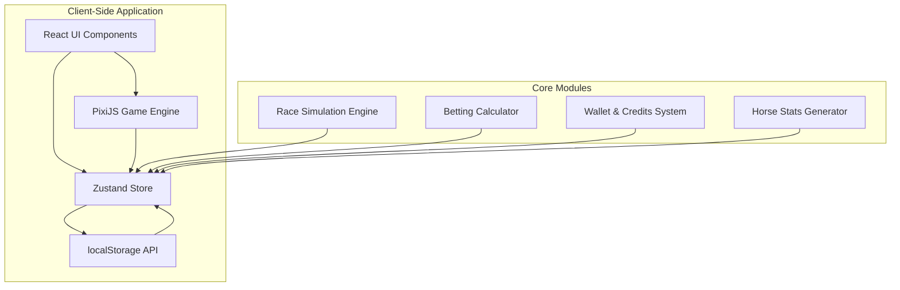
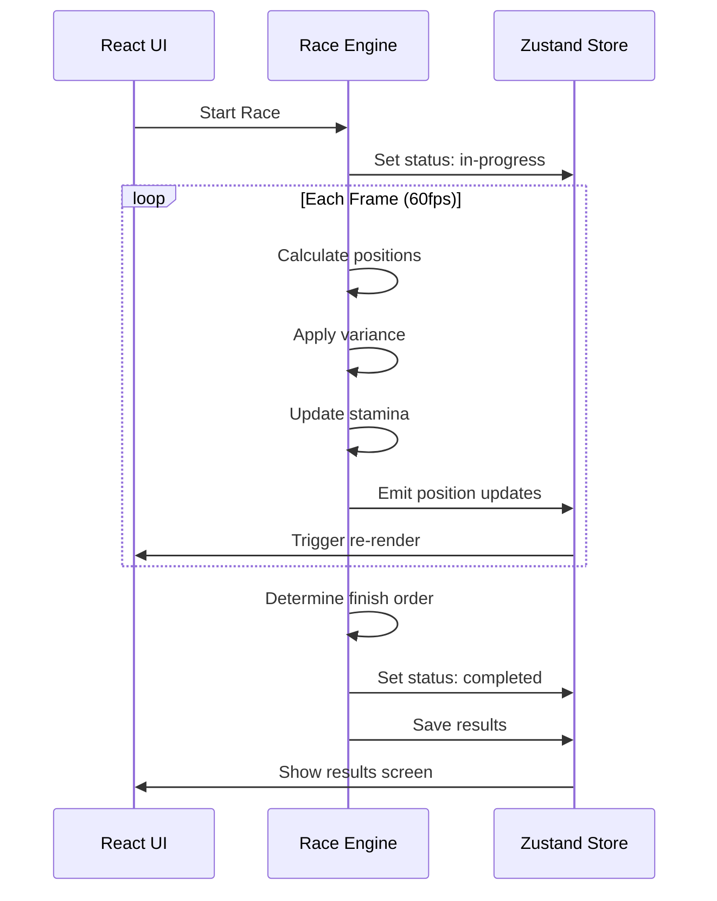
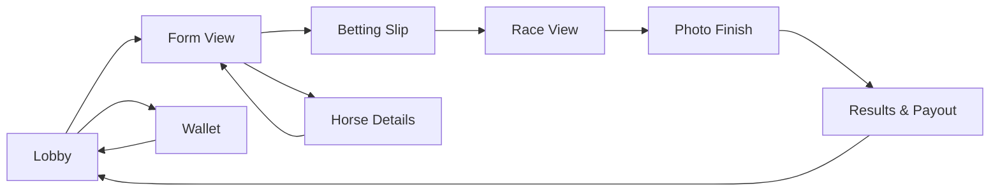

# Turf Sprint - Architecture Plan

## Executive Summary

**Turf Sprint** is a browser-based, 2D side-scrolling horse racing game with an integrated betting simulation. This architecture plan outlines a client-side only solution that can be deployed to Netlify with zero backend infrastructure.

---

## 1. Technology Stack

### Core Technologies
| Component | Technology | Rationale |
|-----------|-----------|-----------|
| **Game Engine** | PixiJS v8 | Lightweight, excellent performance, modern WebGL renderer, perfect for 2D side-scrolling games |
| **UI Framework** | React 18 | Component-based architecture, excellent ecosystem, easy state management |
| **Build Tool** | Vite 5 | Lightning-fast HMR, optimized builds, native Netlify support |
| **Styling** | Tailwind CSS v3 | Utility-first, responsive design, small bundle size |
| **State Management** | Zustand | Lightweight, simple API, perfect for client-side apps |
| **Animation** | Framer Motion | Smooth UI transitions, micro-interactions |
| **Icons** | Lucide React | Tree-shakeable, consistent design system |

### Deployment
- **Platform**: Netlify (static site hosting)
- **CI/CD**: Netlify Build & Deploy pipeline
- **CDN**: Netlify Edge Network for global distribution

---

## 2. System Architecture



### Architecture Principles
1. **Single Source of Truth**: Zustand store manages all application state
2. **Event-Driven**: Game engine emits events that update React state
3. **Persistence**: localStorage saves wallet, bet history, and horse statistics
4. **Separation of Concerns**: Game logic (PixiJS) separate from UI (React)

---

## 3. Data Models

### 3.1 Horse Model
```typescript
interface Horse {
  id: string;
  name: string;
  color: string;
  // Base Stats (0-100)
  topSpeed: number;        // Maximum velocity
  acceleration: number;    // Time to reach top speed
  stamina: number;         // Resistance to fatigue
  consistency: number;     // Reduces variance
  
  // Performance
  trackPreference: 'firm' | 'soft' | 'heavy';
  weatherModifier: number; // Performance in rain
  
  // Historical
  raceHistory: RaceResult[];
  winRate: number;
  totalRaces: number;
  
  // Visual
  spriteConfig: SpriteConfig;
}
```

### 3.2 Race Model
```typescript
interface Race {
  id: string;
  horses: Horse[];
  trackSurface: 'firm' | 'soft' | 'heavy';
  weather: 'clear' | 'rain' | 'muddy';
  distance: number; // in meters
  status: 'scheduled' | 'in-progress' | 'completed';
  startTime: number;
  results?: RaceResult[];
}
```

### 3.3 Bet Model
```typescript
type BetType = 'win' | 'place' | 'show' | 'exacta';

interface Bet {
  id: string;
  raceId: string;
  type: BetType;
  horseIds: string[]; // 1 for win/place/show, 2 for exacta
  amount: number;
  potentialPayout: number;
  status: 'pending' | 'won' | 'lost';
  placedAt: number;
}
```

### 3.4 Wallet Model
```typescript
interface Wallet {
  balance: number;
  totalDeposited: number;
  totalWinnings: number;
  totalLosses: number;
  currentStreak: number;
  bestStreak: number;
  lastDailyReward: number | null;
}
```

### 3.5 User Progress Model
```typescript
interface UserProgress {
  level: number;
  experience: number;
  achievements: Achievement[];
  statistics: {
    totalBets: number;
    winRate: number;
    profit: number;
    favoriteBetType: BetType;
  };
}
```

---

## 4. Component Structure

```
src/
├── components/
│   ├── ui/                    # Reusable UI components (shadcn/ui style)
│   │   ├── Button.tsx
│   │   ├── Card.tsx
│   │   ├── Dialog.tsx
│   │   ├── Badge.tsx
│   │   └── Progress.tsx
│   ├── game/
│   │   ├── RaceCanvas.tsx     # PixiJS container
│   │   ├── HorseSprite.tsx    # Individual horse rendering
│   │   └── TrackBackground.tsx
│   ├── lobby/
│   │   ├── RaceCard.tsx
│   │   ├── HorseList.tsx
│   │   └── CountdownTimer.tsx
│   ├── betting/
│   │   ├── BettingSlip.tsx    # Slide-out panel
│   │   ├── BetTypeSelector.tsx
│   │   ├── OddsDisplay.tsx
│   │   └── PayoutCalculator.tsx
│   ├── results/
│   │   ├── PhotoFinish.tsx
│   │   ├── ResultsTable.tsx
│   │   └── PayoutSummary.tsx
│   └── wallet/
│       ├── BalanceDisplay.tsx
│       ├── DailyReward.tsx
│       └── TransactionHistory.tsx
├── game/
│   ├── engine/
│   │   ├── RaceEngine.ts      # Main race simulation
│   │   ├── PhysicsLite.ts     # Movement calculations
│   │   └── StochasticVariance.ts # Randomness algorithm
│   ├── entities/
│   │   ├── Horse.ts
│   │   └── Track.ts
│   ├── rendering/
│   │   ├── SpriteManager.ts
│   │   ├── AnimationController.ts
│   │   └── CameraController.ts
│   └── audio/
│       ├── SoundManager.ts
│       └── AudioAssets.ts
├── stores/
│   ├── gameStore.ts           # Race state
│   ├── bettingStore.ts        # Betting logic
│   ├── walletStore.ts         # Economy
│   └── horseStore.ts          # Horse data
├── utils/
│   ├── oddsCalculator.ts      # Dynamic odds
│   ├── horseGenerator.ts      # Random horse creation
│   ├── raceScheduler.ts       # Race timing
│   └── localStorage.ts        # Persistence layer
├── hooks/
│   ├── useRace.ts
│   ├── useBetting.ts
│   └── useWallet.ts
├── types/
│   └── index.ts
└── App.tsx
```

---

## 5. Race Simulation Algorithm

### 5.1 Physics-Lite Movement Model

The race simulation uses a simplified physics model that balances realism with performance:

```
Position Update (per frame):
velocity = base_velocity × surface_modifier × weather_modifier × stamina_factor
position = position + velocity × delta_time
```

### 5.2 Stochastic Variance Algorithm

```typescript
function calculatePerformance(horse: Horse, conditions: RaceConditions): number {
  // Base performance from stats
  let performance = horse.topSpeed * 0.4 + horse.acceleration * 0.3 + horse.stamina * 0.3;
  
  // Track surface modifier
  const surfaceBonus = getSurfaceBonus(horse.trackPreference, conditions.trackSurface);
  performance *= surfaceBonus;
  
  // Weather modifier
  if (conditions.weather === 'rain') {
    performance *= (1 - (0.1 * (1 - horse.stamina / 100)));
  }
  
  // Stochastic variance (reduced by consistency)
  const varianceRange = 20 * (1 - horse.consistency / 100);
  const randomFactor = (Math.random() - 0.5) * varianceRange;
  
  return Math.max(0, performance + randomFactor);
}
```

### 5.3 Stamina Fade Mechanic

In the final 25% of the race, stamina affects performance:

```typescript
function applyStaminaFade(horse: Horse, progress: number): number {
  if (progress < 0.75) return 1.0;
  
  const fadeFactor = (progress - 0.75) / 0.25; // 0 to 1
  const staminaDrain = 1 - (horse.stamina / 200); // 0.5 to 1.0
  const fade = 1 - (fadeFactor * staminaDrain * 0.3); // Max 30% fade
  
  return fade;
}
```

### 5.4 Race Flow



---

## 6. Betting System

### 6.1 Dynamic Odds Calculation

Odds are calculated based on:
1. Historical win rate (weight: 40%)
2. Current stats vs. field average (weight: 35%)
3. Track/weather conditions (weight: 25%)

```typescript
function calculateOdds(horse: Horse, race: Race): number {
  const winRateFactor = horse.winRate;
  const statsFactor = compareStats(horse, race.horses);
  const conditionsFactor = assessConditions(horse, race);
  
  const probability = (winRateFactor * 0.4) + (statsFactor * 0.35) + (conditionsFactor * 0.25);
  
  // Convert probability to odds (decimal format)
  return Math.max(1.01, 1 / probability);
}
```

### 6.2 Payout Calculations

| Bet Type | Winning Condition | Payout Formula |
|----------|------------------|----------------|
| Win | 1st place | `odds × stake` |
| Place | 1st or 2nd | `(odds × 0.5) × stake` |
| Show | 1st, 2nd, or 3rd | `(odds × 0.25) × stake` |
| Exacta | Exact 1st & 2nd order | `(odds1 × odds2 × 0.1) × stake` |

### 6.3 Bet Validation

```typescript
function validateBet(bet: Bet, wallet: Wallet): ValidationResult {
  if (wallet.balance < bet.amount) {
    return { valid: false, error: 'Insufficient balance' };
  }
  
  if (bet.amount < MIN_BET) {
    return { valid: false, error: `Minimum bet is ${MIN_BET}` };
  }
  
  if (bet.amount > MAX_BET) {
    return { valid: false, error: `Maximum bet is ${MAX_BET}` };
  }
  
  return { valid: true };
}
```

---

## 7. UI/UX Flow

### 7.1 Screen Flow Diagram



### 7.2 Key Screens

#### Lobby Screen
- Upcoming races with countdown timers
- Track conditions display
- Quick bet option
- Wallet balance indicator
- Daily reward claim button

#### Form View
- Horse list with stats
- Last 5 race results
- Scout notes
- Odds display
- Add to bet slip button

#### Betting Slip (Slide-out Panel)
- Selected bets list
- Stake input
- Potential payout calculation
- Confirm/clear buttons
- Total stake display

#### Race View
- PixiJS canvas (full width)
- Side-scrolling camera
- Progress bar at bottom
- Live position updates
- Race timer

#### Photo Finish
- Stylized finish line image
- Horse names overlay
- Final positions
- "View Results" button

#### Results & Payout
- Final standings table
- Won/lost bets
- Payout breakdown
- Wallet update animation
- "Back to Lobby" button

### 7.3 Design Principles

**Visual Style: Avant-Garde Minimalism**
- Dark theme with high contrast
- Asymmetric layouts
- Generous whitespace
- Micro-interactions on hover/click
- Smooth page transitions

**Color Palette**
- Primary: Emerald green (racing turf)
- Secondary: Gold (winning/money)
- Accent: Crimson (urgency/action)
- Neutral: Slate grays for backgrounds

**Typography**
- Headings: Bold, condensed sans-serif
- Body: Clean, readable sans-serif
- Numbers: Monospace for data consistency

---

## 8. Economy System

### 8.1 Virtual Wallet

```typescript
const ECONOMY_CONFIG = {
  STARTING_BALANCE: 1000,
  DAILY_REWARD: 500,
  DAILY_REWARD_COOLDOWN: 24 * 60 * 60 * 1000, // 24 hours
  MIN_BET: 10,
  MAX_BET: 10000,
};
```

### 8.2 Daily Rewards

- Claimable every 24 hours
- Streak bonus: +50 credits per consecutive day (max 7 days)
- Visual countdown timer
- Notification when available

### 8.3 Leaderboards

Local-only leaderboards (stored in localStorage):
1. **Profit Leaderboard**: Total profit
2. **Streak Leaderboard**: Best win streak
3. **Win Rate Leaderboard**: Highest win percentage

---

## 9. Performance Optimizations

### 9.1 Rendering
- PixiJS WebGL renderer for GPU acceleration
- Object pooling for horse sprites
- Texture atlases to minimize draw calls
- Lazy loading of race data

### 9.2 State Management
- Zustand for minimal re-renders
- Selectors for granular subscriptions
- Debounced localStorage writes
- Computed values for derived state

### 9.3 Bundle Size
- Code splitting by route
- Tree-shaking with Vite
- Dynamic imports for heavy assets
- Compression via Netlify

---

## 10. Implementation Roadmap

### Phase 1: Foundation (Core Infrastructure)
- [ ] Set up Vite + React + TypeScript project
- [ ] Configure Tailwind CSS
- [ ] Set up Zustand stores
- [ ] Create localStorage utilities
- [ ] Build base UI component library

### Phase 2: Game Engine (Race Simulation)
- [ ] Implement PixiJS integration
- [ ] Build horse sprite system
- [ ] Create track rendering
- [ ] Implement physics-lite movement
- [ ] Add stochastic variance algorithm
- [ ] Build stamina fade mechanic

### Phase 3: Betting System
- [ ] Create odds calculator
- [ ] Build betting slip UI
- [ ] Implement bet validation
- [ ] Add payout calculations
- [ ] Create wallet management

### Phase 4: User Interface
- [ ] Build lobby screen
- [ ] Create form view (horse details)
- [ ] Implement race view with camera
- [ ] Design photo finish screen
- [ ] Build results & payout screen
- [ ] Add daily rewards

### Phase 5: Polish & Optimization
- [ ] Add sound effects
- [ ] Implement animations
- [ ] Optimize performance
- [ ] Add achievements
- [ ] Create leaderboards
- [ ] Mobile responsiveness

### Phase 6: Deployment
- [ ] Configure Netlify deployment
- [ ] Set up build pipeline
- [ ] Add analytics (optional)
- [ ] Test on multiple devices
- [ ] Launch

---

## 11. Future Enhancements

### Stable Management
- Buy and name horses
- Training mini-games
- Breeding mechanics
- Custom horse colors

### Advanced Betting
- Trifecta (1st, 2nd, 3rd exact order)
- Quinella (1st & 2nd any order)
- Daily Double (winners of consecutive races)

### Live Commentary
- Text-based play-by-play
- Dynamic race narration
- Highlight moments

### Multiplayer (requires backend)
- Real-time races
- Player vs. player betting
- Syndicates and group betting
- Global leaderboards

---

## 12. Technical Considerations

### Security
- All calculations client-side (not for real money)
- No sensitive data in localStorage
- Input validation on all user inputs
- XSS prevention via React's built-in protections

### Accessibility
- WCAG AA compliance
- Keyboard navigation
- Screen reader support
- High contrast mode option
- Reduced motion option

### Browser Support
- Modern browsers (Chrome 90+, Firefox 88+, Safari 14+, Edge 90+)
- WebGL 2.0 support required
- Mobile browsers (iOS Safari 14+, Chrome Android 90+)

---

## 13. Success Metrics

### Engagement
- Daily active users
- Average session duration
- Races completed per session
- Bet placement rate

### Economy Health
- Average wallet balance
- Bet distribution by type
- Win rate distribution
- Daily reward claim rate

### Performance
- First Contentful Paint < 1.5s
- Time to Interactive < 3s
- 60 FPS during races
- Bundle size < 500KB (gzipped)

---

## Conclusion

This architecture provides a solid foundation for Turf Sprint, balancing performance, maintainability, and user experience. The client-side only approach ensures simple deployment to Netlify while still delivering an engaging, feature-rich horse racing experience.

The modular design allows for incremental development and easy future enhancements, while the chosen technology stack ensures optimal performance and developer experience.
